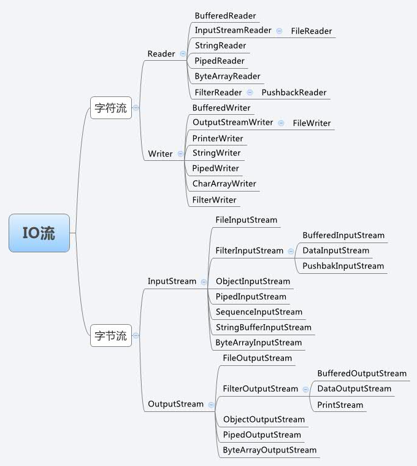
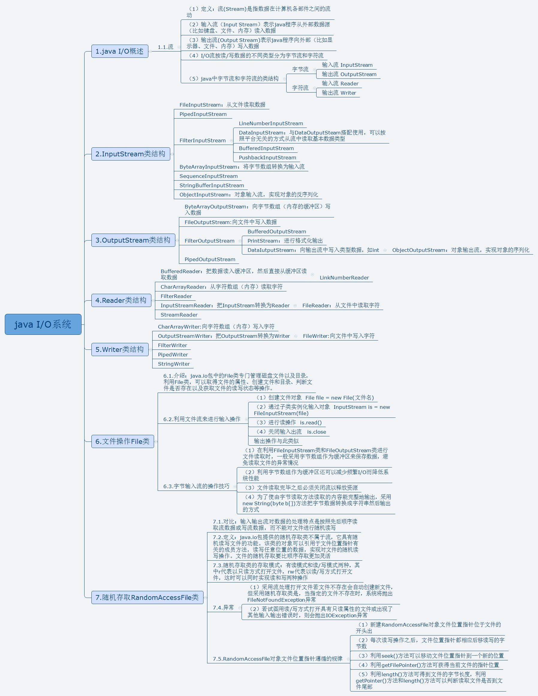

java io 分为字节流和字符流

-   面向字节流的`InputStream`和`OutputStream`
-   面向字符的`Reader`和`Writer`

区别， 字节流使用bit来传输，字符流使用char来传输，实际上字节流的操作不会经过缓冲区（内存）而是直接操作文本本身的，
而字符流的操作会先经过缓冲区（内存）然后通过缓冲区再操作文件。

如何选择:

1.  二进制文件优先使用字节流，当然文本文件也可以使用字节流
2.  如果只是复制纯文本文件不做显示操作，哪个流都可以，如果要显示纯文本就用字符流。


1.  
    

#### Reader

####	1. 研究抽象类Reader 的继承关系如下


1. 首先Reader 实现了两个接口一个是 `Readable `和 `Closeable `接口， 其中Closeable提供了可关闭的方法 close(),并且Closeable 继承了AutoCloseable接口，说明可以通过try catch 自动关闭
2. Readable 接口提供了读方法 方法如下 `public int read(java.nio.CharBuffer cb) throws IOException;`

####	2. Reader 


	#####	1. 三个字段

 -	lock   用于同步操作比如read要加上锁.  字段注释翻译 ： 用于同步此流上的操作的对象。为了提高效率，字符流对象可以使用自身以外的对象来保护关键部分。因此，子类应该使用此字段中的对象，而不是此字段或同步方法。
 -	maxSkipBufferSize  最大跳过bufferSize的大小，默认是8192, 该字段是一个私有静态常量
-	skipBuffer    跳过的缓冲区，在分配之前为空, 跳过的内容会放在这里面。

#####	2.	7 个方法

- read()               读取一个字符,返回读取到的字符的int类型

- read(CharBuffer)    将数据读到CharBuffer里面

- read(char[]))    填充整个数组，从数组的index=0, 填充到数组的末尾， 该方法调用一个抽象方法read(char[])，int,int )留给子类实现

- read(char[])，int,int )    具体的读实现，留给子类实现

- skip(long)   跳过多少个char， 并且将跳过的内容放到skipBuffer里面， 最后返回跳过的真实字符数量

  ```java
      public long skip(long n) throws IOException {
          if (n < 0L)
              throw new IllegalArgumentException("skip value is negative");
          // 跳过的字节数不能超过最大跑过的bufferSize
          int nn = (int) Math.min(n, maxSkipBufferSize);
          synchronized (lock) {
              if ((skipBuffer == null) || (skipBuffer.length < nn))
                  skipBuffer = new char[nn];
              long r = n;
              // 将要跳过的内容写入skipBuffer 数组里面
              while (r > 0) {
                  int nc = read(skipBuffer, 0, (int)Math.min(r, nn));
                  if (nc == -1)
                      break;
                  // 每次减去跳过的字符数
                  r -= nc;
              }
              // 返回真正跳过了多少个字符
              return n - r;
          }
      }
  ```

- read() 如果保证下一个read（）不会阻止输入，则为True，否则为false。请注意，返回false并不保证下一次读取将被阻止.  

- markSupported()  说明此流是否支持mark（）操作。默认实现总是返回false。子类应该重写这个方法。返回：当且仅当此流支持标记操作时为true。

- mark(int)                标记流中的当前位置。对reset（）的后续调用将尝试将流重新定位到此点。并非所有字符输入流都支持mark（）操作。 

- reset()                     重置流。如果流已被标记，则尝试在标记处重新定位。如果未标记流，则尝试以适合特定流的方式重置它，例如将其重新定位到其起点。并非所有字符输入流都支持reset（）操作，有些支持reset（），但不支持mark（）。

#####	3. 总结

​		 Reader 实现了Closeable和Readable 分别实现了close和read()方法，并且提供了make标记流的位置，通过reset重置回流的位置。提供了skip(int) 方法，可以跳过n个字节，并且将跳过的内容放在了skipBuffer里面。 最主要的是提供了read,mark,skip ,reset 4个方法。

下图是直接实现Reader的类，后面我们将继续研究


####	3. StringReader  

> ​	A character stream whose source is a string    源为字符串的字符流

下图是StringReader的一些方法和字段


#####	1.	4个字段

- str    str就是字符串
- length   字符串的长度
- next      下一次读取字符串的位置
- mark    用于标记流的位置

#####	2.	8个方法

- ensureOpen()    确保文件是否打开， 这里直接判断字符串是否为null即可，如果字符串不为返回true

- int read()   读取一个字符串, 

  ```java
      public int read() throws IOException {
          synchronized (lock) {
              ensureOpen();
              if (next >= length)
                  return -1;
              // 每次读完字符串自增1
              return str.charAt(next++);
          }
      }
  ```

- int read(char cbuf[], int off, int len)   读取字符到字符数组里面， off 指定数组的写入字符串的位置，len表示写入几个字符。

  如果该字符串流已经读完直接返回-1，不合法返回0， 大于0的情况下表示读取到了实际字符的个数

```java
    public int read(char cbuf[], int off, int len) throws IOException {
        synchronized (lock) {
            ensureOpen();
            if ((off < 0) || (off > cbuf.length) || (len < 0) ||
                ((off + len) > cbuf.length) || ((off + len) < 0)) {
                throw new IndexOutOfBoundsException();
            } else if (len == 0) {
                return 0;
            }
            if (next >= length)
                return -1;
			//lenght-next 表示,还剩余多少个字符没有读取， 然后和len做比较，获取实际字符的个数
            int n = Math.min(length - next, len);
            str.getChars(next, next + n, cbuf, off);
            // next 指针加上读取字符个数
            next += n;
            return n;
        }
    }
```

- int skip(long ns)   跳过多少个字符

```java
    public long skip(long ns) throws IOException {
        synchronized (lock) {
            ensureOpen();
            if (next >= length)
                return 0;
            // 获取实际能跳过多少个字符，最后next加上实际能跳过的字符个数
            long n = Math.min(length - next, ns);
            n = Math.max(-next, n);
            next += n;
            return n;
        }
    }
```

- boolean ready()   文件是否准备好了

```java
    public boolean ready() throws IOException {
        synchronized (lock) {
        ensureOpen();
        return true;
        }
    }
```

- boolean markSupported()   是否支持标记， 默认返回true

- mark(int readAheadLimit)    从源码中我们可以看到readAheadLimit 是不生效的，就是将mark 记录一下下次读取字符的位置，用于reset操作

  ```java
      public void mark(int readAheadLimit) throws IOException {
          if (readAheadLimit < 0){
              throw new IllegalArgumentException("Read-ahead limit < 0");
          }
          synchronized (lock) {
              ensureOpen();
              mark = next;
          }
      }
  ```

- void reset()   重置next字段的位置， 也就是将next 设置后mark的值， 相当于回滚

#####	3.	代码测试

```java
import java.io.IOException;
import java.io.StringReader;

public class StringReaderTest {
   public static void main(String[] args) throws IOException {
      StringReader sr = new StringReader("hello word");
      System.out.println("跳过了多少个字符" + sr.skip(1));
      // 标记一下读取下一个字符的位置, 这里mark 的参数只要是大于0即可
      sr.mark(1000);
      System.out.println("读取一个字符是:" +(char)sr.read());
      // 回滚位置
      sr.reset();
      System.out.println("读取一个字符是" +(char)sr.read()+", 该字符和上一次读到的字符是相同的，说明位置被重置了");
      //下面读取llo 三个字符
      char[] chars = new char[5];
      // 从chars的index为2开始填充，填充3个字符
      sr.read(chars, 2, 3);
      System.out.println(new String(chars));
   }
}
```

#####	5. 小结

StringReader 主要通过提供mark,reset,read skip 4个方法提供了字符串的读，标记，回滚，和跳过功能。

#### 4. BufferedReader 

  顾名思义，具有缓存的Reader， 下面是BufferedReader 的字段，方法，构造器


#####	1.	字段

- Reader in  		BufferedReader持有的reader对象
- int nChars          下一次读取字符的索引                  
- int   nextChar;    下一次读取字符的索引 
- int INVALIDATED = -2;
-  int UNMARKED = -1;
-  int markedChar = UNMARKED;       用于记录当前读取字符的位置
-  int readAheadLimit = 0;                    索引
- private boolean skipLF = false;
- /** The skipLF flag when the mark was set */
- boolean markedSkipLF = false;
- int defaultCharBufferSize = 8192;
- int defaultExpectedLineLength = 80;


 - BufferedReader(Reader in, int sz)   第一个参数in是Reader接口的实现，第二个参数sz是是设置缓存的大小

   ```
   ```

   

